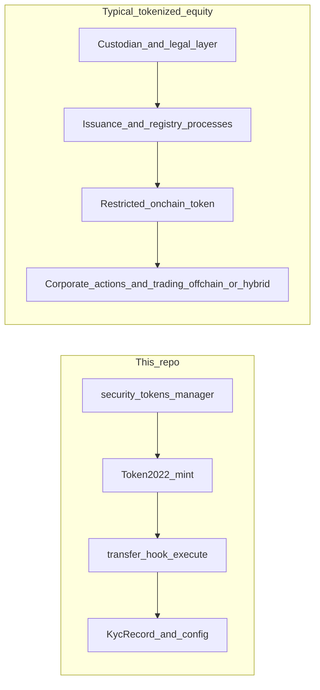

# Tokenized stocks vs this repository (architecture comparison)

**See also:** [Architecture: Token-2022 Security Token Manager](architecture.md) — full design of this codebase.

This document compares **how tokenized equities are usually structured** (on and around Solana) with the **security-token manager** pattern implemented here. It is an **architectural** comparison only: securities law, licensing, and offering structures vary by jurisdiction and are not legal advice.

---

## This project in brief

This repository is an Anchor-based **token factory** with two programs:

| Component | Role |
|-----------|------|
| [`programs/security_tokens_manager/`](../programs/security_tokens_manager/) | Creates Token-2022 mints, per-mint `TokenConfig`, `KycRecord` registration, issuance, freeze/thaw, forced transfer |
| [`programs/transfer_hook/`](../programs/transfer_hook/) | Transfer hook `execute` — enforces KYC, jurisdiction, and AML velocity against on-chain state |

Each mint is isolated: compliance rules, KYC records, and transfer limits are **per token**. Enforcement happens **at transfer time** via the Token-2022 transfer hook, plus optional issuer actions (freeze, delegate-based moves). For details, see [architecture.md](architecture.md).

---

## How tokenized stocks are usually built (conceptual layers)

Tokenized “stocks” are not a single on-chain recipe. Most real-world programs combine **off-chain legal and operational** layers with **restricted on-chain tokens**.

### 1. Economic and legal layer (mostly off-chain)

- **Underlying shares** are typically held by a **custodian** or similar arrangement; the on-chain asset often represents **beneficial interest**, a **depositary-style** claim, or another instrument defined in offering documents.
- **Issuer and transfer agent** obligations (registry, restrictions on transfer) drive **who may hold and trade**, independent of which L1 you use.
- **Permissioned transfers** are a regulatory default for many equity-like instruments — similar *goals* to on-chain allowlists and hooks, but the **source of truth** for corporate records often remains off-chain.

### 2. On-chain representation (Solana)

- Implementations frequently use **SPL Token or Token-2022** with **restrictions**: mint/account authorities, **transfer hooks**, freezes, or allowlisted counterparties.
- That pattern is **conceptually aligned** with this repository: a program-enforced rule set at transfer time, not “paper policy only.”
- The **business** workflows around the token differ from generic debt or fund tokens: **inventory at brokers**, **settlement** conventions, and **corporate actions** dominate operational design.

### 3. What equity programs often add beyond a generic security token

| Area | Typical focus |
|------|----------------|
| **Corporate actions** | Stock splits, dividends or distributions, rights, voting — often **orchestrated off-chain** or with **additional services** (oracles, dedicated programs, manual issuer workflows). A transfer hook alone does not implement dividend plumbing. |
| **Trading and liquidity** | **Broker-dealer** or **ATS**-style flows, internalization, **restricted secondary markets** — frequently **off-chain** or application-layer, not only a public DEX. |
| **Eligibility** | Same broad theme as KYC (investor type, jurisdiction, holding periods tied to exemptions). This repo models **KYC level**, **jurisdiction allowlists**, and **velocity**; a production equity stack might add **broker accounts**, **omnibus** structures, or **time locks** not present here. |
| **Custody and reconciliation** | Linking the **token ledger** to **custodian books** (reports, attestations, operational reconciliation). This codebase does not implement custodian proofs or share-registry sync. |

---

## Side-by-side comparison

| Topic | This repository | Typical tokenized-equity stack |
|--------|-----------------|--------------------------------|
| **Primary goal** | Reusable **compliance-enforced** Token-2022 issuance and transfers (factory + hook). | **Legally and operationally** correct representation of equity-like interests, often with heavy off-chain operations. |
| **Transfer control** | Transfer hook + `KycRecord` + `TokenConfig` + velocity `TransferRecord`. | Often similar **technical** tools; plus **broker / transfer agent** processes. |
| **Corporate actions** | Not in scope (would be separate systems or instructions). | **Central** to equity; usually explicit pipelines. |
| **Trading venue** | Does not define an exchange or ATS; transfers are validated on-chain. | Often **explicit** trading and settlement arrangements. |
| **Custody** | Does not custody underlying shares or prove reserves. | **Custody and registry** are usually first-class in the overall architecture. |
| **Identity model** | Trusted **KYC operator** writes `KycRecord`; chain does not verify the off-chain KYC process itself. | Often similar **operator** model; may add **participant IDs** (e.g. broker entities) beyond a single wallet record. |

---

## Diagram: two architectural sketches

The left path is **what this codebase implements**: factory, mint, hook, and on-chain compliance state. The right path is **typical** for equities: custody and legal structure first, then issuance pipelines, then a restricted token, with corporate actions and **many** trading workflows **outside** the hook alone.

---

## When this repository’s pattern fits

Use this project’s architecture when you need **Solana-native enforcement** of **KYC/AML-style rules** at transfer time for **Token-2022** mints you control: per-mint configuration, frozen-by-default accounts, optional memos, delegate-based compliance actions, and velocity limits.

Treat **tokenized listed equities** as a **superset problem**: you may still use the same **token + hook** ideas, but you should plan **explicit** designs for **corporate actions**, **broker and custody alignment**, and **offering-specific** transfer restrictions — none of which are fully specified by this repository alone.

---

## Disclaimer

This document describes **software architecture** and common industry patterns. It does **not** constitute legal, investment, or compliance advice. Tokenized securities are regulated differently across jurisdictions; consult qualified counsel and compliance professionals for production offerings.
